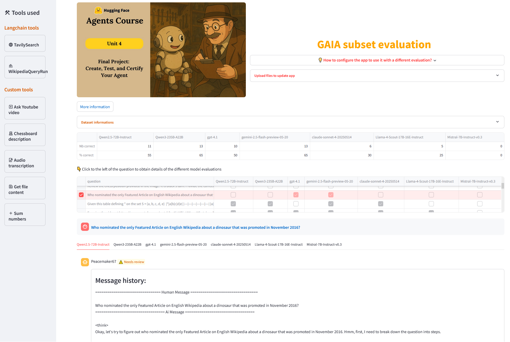

# Explore agent's results on a GAIA subset

This is the final project of the Agents course proposed by Huggin Face, in may 2025 :  
('Agents Course - Final Unit)[https://huggingface.co/learn/agents-course/unit4/introduction]

App is hosted on HuggingFace : [GAIA Agents Evaluation](https://huggingface.co/spaces/Loren/GAIA_Agents_Evaluations)

